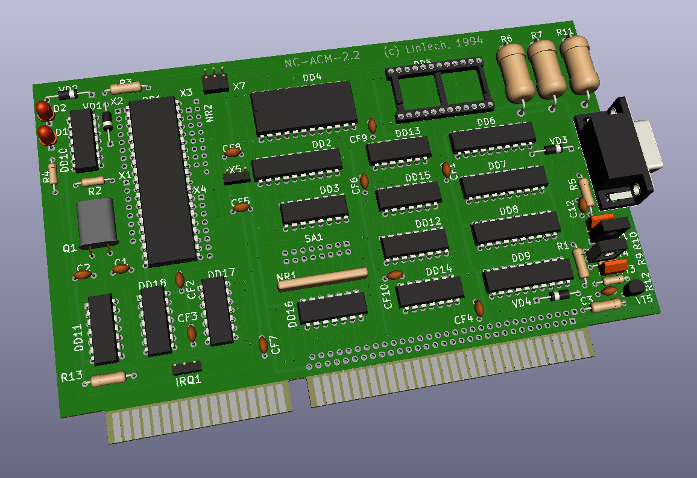

# LInTech - плата Головной Машины

В данный момент работа над реконструкцией платой в стадии завершения. Уточняются номиналы компонентов и несколько линий.

Плата воссоздана Night Gryphon по фотографиям и материалам предоставленым [Arseny](http://uknc.narod.ru/).
Спасибо:
- Arseny за исходные и дополнительные фото оригинальной платы, отсмотр/прозвонку непонятных мест
- [Maxiol](https://forum.maxiol.com/) за помощь в воссоздании/проверке аналоговой части схемы.
- Станиславу Масловски за опознание маркировки компонентов

Содержание:
- KiCad - проект реконструкции платы в формате KiCad
- LinTech-GM-board_NC-ACM-2.2.pdf - реконструированая схема платы
- Gerbers - GERBER файлы для изготовления реплики
- LinTech-GM-board_NC-ACM-2.2-BOM.html - BOM, список компонентов
- Firmware - микропрограмма контроллера Intel 8051
- Reference_Photo - исходные фото по которым велась реконструкция

Библиотека прошивок микроконтроллера платы любезно предоставлена Станиславом Кононовым из ЛИнТех при содействии [Serebriakov](https://zx-pk.ru/members/7629-serebriakov.html).

В текущем проекте представлена плата версии 2.2 от Arseny. 

Плата версии 2.3 имеется у [Serebriakov](https://zx-pk.ru/members/7629-serebriakov.html). 
Отличие от 2.2 не полностью различимо ввиду низкого качества имеющихся фотографий, но навскидку выглядит как улучшеная версия 2.2 без принципиальных отличий. Из видимого:
- линия запроса прерывания вынесена из под кварцевого резонатора и добавлен земляной полигон - возможно решена проблема помех на этой линии.
- светодиоды перенесены рядом с планкой и теперь видны снаружи корпуса РС
- отсутствует часть компонентов в цепях сопряжения с линией
- джамперы заменены печатными перемычками
Поскольку Павел обещал фото лучшего качества - детальная реконструкция 2.3 отложена до их появления. 

На данный момент реальные платы по данной реконструкции не изготавливались / не тестировались, в проекте возможны неточности.

## Техническое описание
[WIP]
Плата построена на базе микроконтроллера Intel 8051 (ДД1).
 
ОЗУ контроллера расширено 573РУ10 (ДД4). Возможно размещение в этом ОЗУ как данных так и исполнение кода.
Возможна работа с микропрограммой во внешнем ПЗУ (ДД5) (требует уточнения) после установки джампера Х5 в положение 2-3.

Адресное пространство контроллера разбито на 4 части по старшим битам адреса 14 и 15, реализуется дешифратором ДД3:
- В старшей части 0xFххх расположен порт данных обмена с РС построеный на 1533ИР22 (ДД6, ДД7). 
- В адресах 0х4ххх расположено дополнительное ОЗУ
- В адресах 0х0ххх (предположительно) может быть установлено ПЗУ с внешней микропрограммой (ДД5)

При записи от РС в порт данных выдается прерывание Int0 (триггер ДД13-А). Младший бит адреса порта данных в который производилась запись может быть прочитана из Р3 бит 4.

При чтении РС из порта данных выдается прерывание Int1 (триггер ДД13-Б)

Для запроса прерывания РС необходимо выставить "1" в Р3 бит 5.

При перезагрузке РС по сигналу RESET на шине ISA микроконтроллер так же переводится в ресет до снятия бита ресета со стороны РС записью "0" в бит 7 порта управления.

Обмен с линией осуществляется через последовательный порт.

### Интерфейс PC
Порты В/В:
0x0120, 0х0121 - порт данных (Port 67: ДД6, ДД7)
0x0122 - порт статуса и управления (Port 89: ДД8, ДД9)
Чтение:
	3 - "1" = поступили данные от контроллера
	4 - "1" = порт данных занят, данные еще НЕ прочитаны контроллером
	5 - контроллер выход T1/Port3.5
	6 - "1" = разрешено прерывание
	7 - перемычка SA.8

Запись
	6 - "1" = разрешить прерывание
	7 - ресет контроллера. После перезагрузки PC контроллер находится в ресете и надо записать "0" в этот бит для старта платы.

Прерывание 11 (может быть изменено на 2 джампером IRQ) - выход MCU T0/Port3.4 разрешается записью "1" в бит 6 регистра управления.

Известные проблемы платы:
- при использовании прерывания ISA у некоторых экземпляров платы происходили его ложные срабатывания/помехи вплоть до "завешивания" РС. 
Предположительно связано с разводкой линии прерывания на плате версии 2.2. В плате версии 2.3 это было изменено.

### Описание микропрограммы
[Требуется помощь]

## Сетевой протокол
[Требуется помощь]