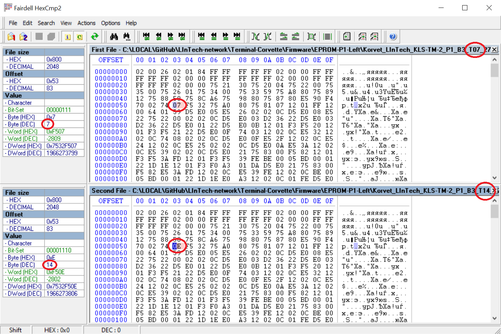

# LInTech - плата Терминальной Машины (ТМ) - клиента ПК Корвет (ПК 8010/8020 «Корвет»)

Плата в процессе воссоздания [Night Gryphon'ом](https://github.com/nightgryphon) по фото и сканам имеющихся в наличии у [Serebriakov](https://github.com/PaulArgent) и [Lordamot](https://github.com/lordamot) оригиналам.

- Reference_Photo - фото и сканы плат
- Firmware - микропрограммы (прошивки)

## Техническое описание
[WIP]

Плата построена на базе микроконтроллера Intel 8051 (серия Intel MCS-51), который обычно представлял собой один из следующих чипов:
- ATMEL AT89C51
- SIEMENS SAB8051A-P

Программа контроллера размещена во внешних ПЗУ EPROM 2716 (КС573РФ2, КС573РФ5) или EPROM 2732 - ставили то, что было в наличае на заводе изготовителе.

## Интерфейс клиента ПК Корвет

## Описание микропрограммы

### Выбор номера Терминальной Машины

У каждой Терминальной Машины имеется свой номер в сети, который зашит в EPROM 2716 - **П1** (чип слева на плате рядом с Intel 8051).

Номер печатался на налейке EPROM 2716 - **П1**, а так же на наклейке микроконтроллера Intel 8051 в формате: **Т00**, где вместо **00** шел номер Терминальной Машины, указанный в прошивке. Например, **T07** для **7-ой** машины в сети.

Номер **00** присваивался первой машине в сети, ограничение по максимальному количеству терминалов - **32**.

Пример сравнения двух прошивок версии **B3** для **7-ой** машины в сети и **14-ой**:

Таким образом, поменяв данный байт с номером прошивки, мы можем пропатчить прошивку для любого номера.

### Версии плат

Имеются две версии платы:
- c одним распаянным EPROM 2716:
  - **КЛС-ТМ-2 П0** - чип справа на плате
- c двумя распаянными EPROM 2716:
  - **КЛС-ТМ-2 П0** - чип справа на плате
  - **КЛС-ТМ-2 П1** - чип слева на плате рядом с Intel 8051

Все прошивки имеют размер 2кб (16кбит).

Прошивки в чипах П0 сопадают на платах с одним EPROM 2716 и двумя EPROM 2716.

На платах с EPROM 2732 4кб (32кбит), первые 2кб прошивки заполнены пустотой с кодом 0xFF (255), остальные 2кб - самой прошивкой.

### Маркировка чипов

На платах обнаружились две версии прошивок: **B3** и **B3t**.

Микроконтроллер Intel 8051 (серия Intel MCS-51) маркировался наклейками:
- **КЛС - ТМ - 2 П1 B3 T00**

или
- **КЛС - ТМ - 2 П1 B3t T00**

хотя внутри не имел прошивки и версия назначалась в зависимости от содержтмого EPROM 2716 - **П1**.

EPROM 2716 маркировались наклейками:
- **КЛС-ТМ-2 П0 B3** - чип справа на плате
- **КЛС-ТМ-2 П1 B3 T00** - чип слева на плате рядом с Intel 8051

или
- **КЛС-ТМ-2 П0 B3t** - чип справа на плате
- **КЛС-ТМ-2 П1 B3t T00** - чип слева на плате рядом с Intel 8051

в зависимости от версии прошивки внутри чипа.

Встречались платы с перемешанными версиями прошивок на чипах, т.е. в **П0** была зашита прошивка версии **B3**, а в **П1** прошивка версии **B3t** и наоборот: в **П0** - **B3t**, В **П1** - **B3**. Как это влияло на работу предстоит выяснить. Но в подавляющем большиснтве сохранившихся плат, обе EPROM были одной вресии. 

# Сетевой протокол
[Требуется помощь]

# Ссылки
Дружественный проект по реконструкции платы для ПЭВМ Корвет от коллег NexusOfPenza и Lordamot
[https://github.com/lordamot/retro-lintech](https://github.com/lordamot/retro-lintech)
